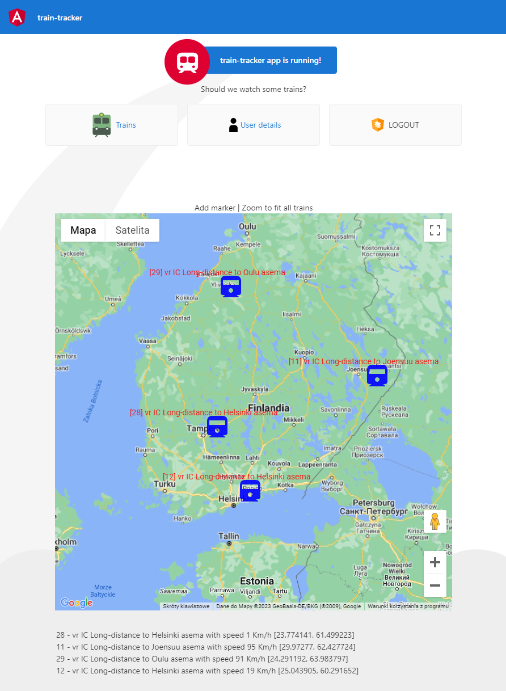

# train-tracker
angular + spring boot 3, oauth2 secured



**Important**: Repository doesn't contain the Google API Key due to safety reasons. This means that when you run the app locally you won't be able to see the map. 

# Running locally
Follow the steps in given order
## Start docker compose

*Prerequisite*: docker daemon installed and running

```shell
docker compoose up
```
This will start:
- Postgres DB (to be used by Keycloak)
- Keycloak server
## Start train-tracker backend

*Prerequisite*: java 19 jdk installed

```shell
gradlew bootRun --args='--spring.profiles.active=local'
```

This will start API service for train-tracker available at http://localhost:8080

Swagger UI is available at http://localhost:8080/swagger-ui.html

## Start train-tracker UI

*Prerequisite*: node 18 installed

```shell
cd ui
ng serve
```

This will start UI application available at http://localhost:4200
